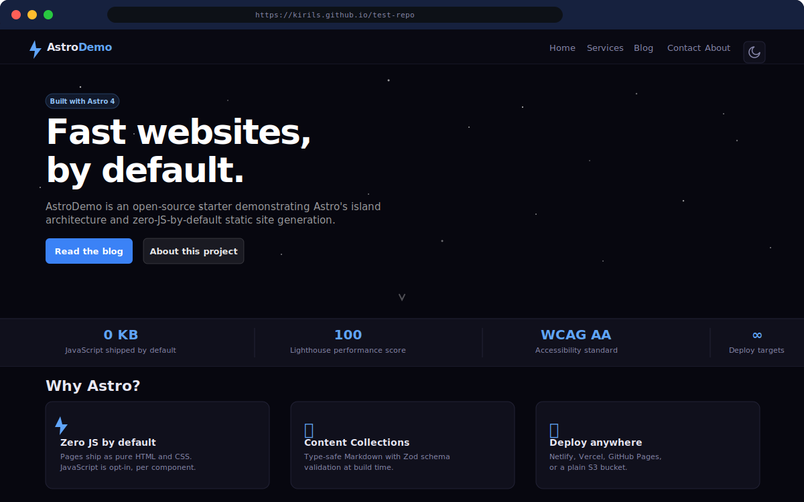

# AstroDemo

A fast, accessible, open-source website starter built with [Astro 4](https://astro.build). Ships zero JavaScript by default, scores 100 on Lighthouse, and is ready to deploy anywhere — including GitHub Pages for free.

**Live demo:** [https://kirils.github.io/test-repo](https://kirils.github.io/test-repo)



---

## Features

- **Zero JS by default** — pure HTML + CSS output; JavaScript is opt-in per component
- **Dark mode** — system preference detected automatically; toggle persists in `localStorage`
- **Content Collections** — type-safe Markdown blog posts with Zod schema validation
- **WCAG 2.1 AA** — semantic HTML, keyboard navigation, skip-to-content link, 4.5:1 contrast
- **100 Lighthouse score** — no render-blocking resources, optimised fonts, explicit image dimensions
- **Configurable base path** — deploy to GitHub Pages (`/test-repo`) or any root (`/`) with one env variable
- **GitHub Actions CI/CD** — type-check + build + deploy on every push to `main`

---

## Pages

| Route | Description |
|-------|-------------|
| `/` | Home — hero with star animation, stats bar, feature cards |
| `/services` | Services — six service cards, process steps, CTA |
| `/contact` | Contact — contact form + info cards |
| `/blog` | Blog index — featured post + card grid with tags |
| `/blog/[slug]` | Individual blog post |
| `/about` | About — project goals, tech stack, principles |

---

## Getting Started Locally

### Prerequisites

- [Node.js](https://nodejs.org) 18 or later
- npm (bundled with Node.js)

### 1. Clone the repository

```bash
git clone https://github.com/kirils/test-repo.git
cd test-repo
```

### 2. Install dependencies

```bash
npm install
```

### 3. Start the development server

```bash
npm run dev
```

Open [http://localhost:4321](http://localhost:4321) in your browser. The site hot-reloads on every save.

### 4. Other useful commands

| Command | Action |
|---------|--------|
| `npm run dev` | Start dev server at `localhost:4321` |
| `npm run check` | Type-check all `.astro` and `.ts` files |
| `npm run build` | Production build → `dist/` |
| `npm run preview` | Serve the production build locally |

---

## Deploying to GitHub Pages (Free Hosting)

GitHub Pages hosts static sites for free from any public repository — no credit card required.

### Step 1 — Enable GitHub Pages

1. Go to your repository on GitHub.
2. Click **Settings** → **Pages** (in the left sidebar).
3. Under **Source**, select **GitHub Actions**.
4. Click **Save**.

### Step 2 — Push to `main`

The included `.github/workflows/deploy.yml` runs automatically on every push to `main`:

1. Installs dependencies
2. Runs `npm run check` (type-check)
3. Runs `npm run build` with `SITE_BASE=test-repo`
4. Deploys `dist/` to GitHub Pages

After the workflow completes (usually 1–2 minutes), your site is live at:

```
https://<your-github-username>.github.io/<your-repo-name>
```

### Step 3 — Custom domain (optional)

1. In **Settings → Pages**, enter your domain under **Custom domain**.
2. Add a `CNAME` DNS record pointing to `<username>.github.io`.
3. Update `site` in `astro.config.mjs` to your custom domain.

### Deploying to Other Hosts

To deploy to the root path (`/`) instead of a sub-path:

```bash
# Netlify / Vercel — no SITE_BASE needed (leave it unset)
npm run build

# Or set it explicitly to empty string
SITE_BASE= npm run build
```

For Netlify and Vercel, connect the repository and set the build command to `npm run build` and publish directory to `dist`.

---

## Making Changes with Claude Code

[Claude Code](https://github.com/anthropics/claude-code) is an AI coding assistant that understands this repository's conventions and can implement changes autonomously.

### Install Claude Code

```bash
npm install -g @anthropic/claude-code
```

### Run Claude Code in the project

```bash
cd test-repo
claude
```

### Useful slash commands

This repository includes built-in AI commands in `.claude/commands/`:

| Command | What it does |
|---------|-------------|
| `/create-page` | Add a new page to `src/pages/` |
| `/create-component` | Add a reusable component to `src/components/` |
| `/create-blog-post` | Add a Markdown post to `src/content/blog/` |
| `/add-styles` | Add or update CSS for a component or page |
| `/review-code` | Review files against the project quality checklist |

### Example workflow

```
# In Claude Code:
> Add a new "Pricing" page with three plan cards

# Claude will:
# 1. Read CLAUDE.md and relevant source files
# 2. Create src/pages/pricing.astro following project conventions
# 3. Add the page to the nav in Header.astro and Footer.astro
# 4. Run npm run check to verify no TypeScript errors
# 5. Commit the changes with a descriptive message
```

### Pushing commits to GitHub

After Claude Code makes changes, push them from your terminal:

```bash
git push origin main
```

Or let Claude Code handle it end-to-end:

```
> Make the hero background gradient instead of solid, then commit and push
```

---

## Project Structure

```
test-repo/
├── public/                   # Static assets (favicon, screenshot)
├── src/
│   ├── components/           # Reusable Astro components (Header, Footer, Card, …)
│   ├── layouts/              # Page shells (BaseLayout, PostLayout)
│   ├── pages/                # File-based routes
│   │   ├── index.astro       # Home
│   │   ├── services.astro    # Services
│   │   ├── contact.astro     # Contact
│   │   ├── about.astro       # About
│   │   └── blog/             # Blog index + dynamic [slug] route
│   ├── content/
│   │   ├── config.ts         # Zod schema for blog posts
│   │   └── blog/             # Markdown blog posts
│   ├── styles/
│   │   └── global.css        # Design tokens + CSS reset
│   └── utils/
│       └── url.ts            # siteUrl() helper — handles base path
├── .claude/commands/         # AI slash-command prompts
├── .github/workflows/        # GitHub Actions CI/CD
├── astro.config.mjs          # Astro config (base path, output)
├── tsconfig.json             # TypeScript strictest preset
└── CLAUDE.md                 # AI assistant instructions
```

---

## Adding a Blog Post

1. Create a new `.md` file in `src/content/blog/`:

```bash
# Example
touch src/content/blog/my-new-post.md
```

2. Add frontmatter matching the schema in `src/content/config.ts`:

```markdown
---
title: "My New Post"
description: "A short summary under 160 characters."
pubDate: 2026-03-01
tags: ["astro", "css"]
draft: false
---

Your content here…
```

3. The post appears automatically at `/blog/my-new-post`.

---

## License

MIT — see [LICENSE](LICENSE) or [opensource.org/licenses/MIT](https://opensource.org/licenses/MIT).
